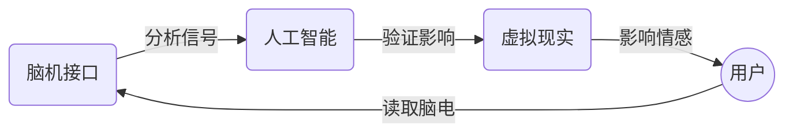

# 项目目标
## 总体目标

#### 基本目标
完成 BMI-AI-VR 闭环，实现可以展示的项目

#### 进阶目标
1. 设计并实现针对性的虚拟现实场景，达到情感影响的目标
2. 重新设计并实现脑机接口模块，完成对大脑信号更精确的读取
3. 提出更好的人工智能模块，完成对大脑信号的精确分析
4. 设计合理的可视化方式，完成当前情绪的可视化

### 虚拟现实
#### 基本目标
在一体机上完成 VR 场景或视频的上传

#### 进阶目标
设计并实现针对性的虚拟现实场景，达到情感影响的目标

### 脑机接口
#### 基本目标
在一体机上完成对脑电信号的读取

#### 进阶目标
重新设计并实现脑机接口模块，完成对大脑信号更精确的读取

### 人工智能
#### 基本目标
完成对情感的分类器

#### 进阶目标
1. 提出更好的人工智能模块，完成对大脑信号的精确分析
2. 设计合理的可视化方式，完成当前情绪的可视化
